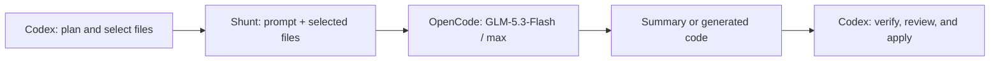

# shunt

A plugin that delegates bulk file reads and boilerplate generation. In Codex,
the lead is Astra at medium effort and the worker is OpenCode
`zai-coding-plan/glm-5.3-flash` at `max`, using the Z.AI Coding Plan.
Claude Code keeps the existing AiKA route and read hooks.

## Choose a route

| Host | Lead | Worker | Delegation trigger |
| --- | --- | --- | --- |
| Codex | `gpt-6-astra` / `medium` with the launcher | OpenCode `zai-coding-plan/glm-5.3-flash` / `max` | The bulk-reader and code-writer skills |
| Claude Code | Your current Claude model | AiKA bulk-reader and code-writer modes | Skills, plus hooks for large reads |

Codex support is skill-driven. The Claude Code Read/Bash hooks do not enforce
routing in Codex. Installing the plugin alone does not select a lead model or
turn every task into delegated work.

## Codex + OpenCode

### Prerequisites

- Codex and OpenCode installed and available on `PATH`.
- Python 3 and a POSIX environment (the transport uses process groups).
- Z.AI Coding Plan authentication configured in OpenCode. No Portal instance or
  portal plugin is required for this route.

Check your account and catalog without starting a worker task:

```bash
opencode auth list
opencode models zai-coding-plan --verbose
```

The catalog must expose `zai-coding-plan/glm-5.3-flash` and its `max` variant.
If needed, run `opencode auth login` and choose **Z.AI Coding Plan**, not a
separate pay-as-you-go provider. Shunt reuses the credentials managed by OpenCode.

### Install and launch

From the root of a checkout containing this implementation:

```bash
codex plugin marketplace add "$PWD"
codex plugin add shunt@portal
plugins/shunt/scripts/codex-shunt -C /absolute/path/to/project \
  'Use shunt for bulk reading and boilerplate generation. Verify worker output before applying changes.'
```

The launcher passes `--model gpt-6-astra` and
`-c 'model_reasoning_effort="medium"'` to Codex. It forwards the remaining
arguments unchanged and leaves global model and approval settings intact.
Run it from the repository root, or use its absolute path from another directory.

Start a **new thread** after installation. In the **Codex app**, select
**Astra / Medium** yourself and ask to use shunt. A plugin installation does not
change the model of an existing conversation.

### What happens during a delegation



Codex owns the task and decides what to delegate. The worker receives the
selected files through stdin and answers one focused request. It has no tool
permissions: it cannot browse the project, run tests, or edit files itself.
Code generation returns through `code-write`; that script writes the answer
only when you supply `--target`.

OpenCode runs in a fresh temporary working directory with external plugins and
sharing disabled. It still loads global configuration and stores local sessions.
Shunt does not copy credentials or resume prior sessions. Each call consumes
subscription quota, including follow-ups that resend the same files.

### Example: explain a module without editing it

Run from this repository root:

```bash
SHUNT_BACKEND=opencode plugins/shunt/scripts/bulk-read \
  --question 'Explain validation and name its boundary tests in four bullets.' \
  --paths /absolute/path/to/project/src/domain.rs
```

Pass multiple files after `--paths` for a cross-file question. The answer goes
to stdout; successful calls report this metadata on stderr:

```text
[shunt: zai-coding-plan/glm-5.3-flash | max | session <session-id>]
```

An answer is not a verification result. Check the named functions, values, and
test assertions against source before using the summary to make changes.

### Example: generate a file for review

```bash
SHUNT_BACKEND=opencode plugins/shunt/scripts/code-write \
  --spec 'Generate boundary tests matching this reference. Output only the test file.' \
  --reference /absolute/path/to/project/tests/existing.rs \
  --target /tmp/generated-tests.rs
```

Choose a scratch target you are happy to replace. `--target` overwrites that
file on success; it does not merge changes. The reference is required. Omit
`--target` to print the generated code instead. Review the result before moving
it into the project, then run the relevant project checks with the lead agent.

The transport discards failed, empty, or incomplete answers before the script
writes a target. It rejects responses over 4 MB and bounds each invocation with
`SHUNT_TIMEOUT_SECONDS` (default 180). There is no fallback to another model.

### Troubleshooting

| Symptom | What to do |
| --- | --- |
| Codex does not discover the shunt skills | Confirm `codex plugin add shunt@portal` succeeded, then start a new thread. |
| The lead is still on another model or effort | Use `scripts/codex-shunt` from the plugin directory, or select Astra / Medium in the app. |
| A direct script call tries Portal/AiKA | Prefix the command with `SHUNT_BACKEND=opencode`. AiKA remains the default for direct calls. |
| `FileSystem.open (.../opencode.log)` or sandbox-blocked network access | Use the host's normal command-escalation flow for the same script. OpenCode needs local log/state writes and network access; do not disable the sandbox globally. |
| Missing model, authentication failure, or exhausted quota | Check `opencode models zai-coding-plan --verbose` and `opencode auth list`; resolve the account/catalog issue before retrying. Shunt does not switch providers. |
| Request exceeds the payload limit | Select fewer or smaller files, or explicitly set `SHUNT_MAX_PAYLOAD_BYTES` for this command. |
| Invocation times out | Split the work into a smaller request, or increase `SHUNT_TIMEOUT_SECONDS` for a deliberately larger task. |
| Summary contains a wrong claim | Verify against source and correct it in Codex; successful transport does not establish correctness. |

Provider/auth/quota errors are returned without automatic retries. For larger
requests, environment overrides apply to a single command:

```bash
SHUNT_BACKEND=opencode SHUNT_TIMEOUT_SECONDS=300 \
  plugins/shunt/scripts/bulk-read \
  --question 'Summarize the responsibilities of these modules.' \
  --paths /absolute/path/to/project/src/first.rs /absolute/path/to/project/src/second.rs
```

### What has been tested

The implementation was exercised with Codex CLI **0.154.0**, OpenCode **1.18.30**,
and Python **3.14.6** on macOS. These are tested versions, not declared minimums.
A live read-only test on a Rust project verified that an Astra/medium lead could
invoke the installed shunt skill, receive a GLM-5.3-Flash/max summary through the
Z.AI Coding Plan, and check it against source without editing the project.

The lead corrected worker wording during verification. This was a functional
smoke test, not a quality benchmark or a measurement of GLM token savings.
The token-savings figures below apply only to the existing AiKA benchmarks.

Model/effort options follow the [Codex configuration reference](https://learn.chatgpt.com/docs/config-file/config-reference)
and [OpenCode CLI](https://opencode.ai/docs/cli/).

## Claude Code + AiKA: how it works

Three layers, from hard gate to soft suggestion:

1. **Hooks** block Claude from reading large files and redirect to the bulk-reader skill
2. **Scripts** handle the AiKA invocation and output cleanup
3. **Skills** tell Claude when and how to call the scripts

Claude never assembles bash pipelines from prose. It calls a script with named arguments. The scripts handle everything internally.

Delegation goes through the Portal CLI actions registry — one `aika:invoke-chat` call per delegation — so the plugin works against any Portal instance with AiKA enabled. Modes are addressed by name and resolved server-side: case-insensitive, preferring your own mode, then your groups', then public ones; a name matching nothing or several modes equally fails with the candidate ids.

### AiKA prerequisites and setup

- [`jq`](https://jqlang.org) — `brew install jq`
- The **portal** plugin from this marketplace, which provides the Portal CLI that shunt delegates through:

```bash
claude plugin install portal@portal
```

Then, in a new session, set up and authenticate the CLI against your Portal instance:

```text
/portal:setup
```

Check whether the two AiKA modes (`bulk-reader` and `code-writer`) already exist on your instance — many instances ship them as public modes:

```bash
portal-cli actions aika:list-modes --json --input '{"search": "bulk-reader"}'
```

If they exist, no mode creation is needed — just install the plugin and go. If not, or to create your own customized versions (e.g. different model or instructions):

```bash
portal-cli actions aika:create-mode --input '{
  "name": "bulk-reader",
  "description": "Bulk file reader for code analysis",
  "instructions": "You are a precise code analyst. Read the provided files and answer the question concisely. Output structured bullets only. No greetings, no prose, no preambles, no summaries. Lead every bullet with the exact name, type, or line number. Use nested bullets for details. Skip anything the caller did not ask for.",
  "tags": ["coding", "delegation"],
  "resource_limits": { "temperature": 0.2 }
}'

portal-cli actions aika:create-mode --input '{
  "name": "code-writer",
  "description": "Boilerplate code generator",
  "instructions": "You generate code files based on a spec and reference files. Match the existing patterns, conventions, naming, and style exactly. Output only the code — no explanations, no markdown fences unless asked. If the spec is ambiguous, make reasonable choices that match the patterns in the reference code.",
  "tags": ["coding", "delegation"],
  "resource_limits": { "temperature": 0.2 }
}'
```

A mode you create is private and owned by you, and name resolution prefers your own modes — so your customized `bulk-reader` automatically shadows the public one, no configuration needed.

## Plugin structure

```
shunt/
├── .claude-plugin/
│   └── plugin.json          # Claude Code manifest
├── .codex-plugin/
│   └── plugin.json          # Codex manifest
├── hooks/
│   ├── hooks.json           # Hook registration (PreToolUse matchers)
│   ├── check-file-size      # Blocks Read on files > 350 lines
│   └── check-bash-read      # Blocks cat/head/tail on large files
├── scripts/
│   ├── lib/
│   │   ├── aika.sh          # Portal aika:invoke-chat transport
│   │   ├── opencode.py      # Tool-free GLM worker transport
│   │   └── transport.sh     # Backend selection; AiKA remains the default
│   ├── bulk-read            # Selected files + question → summary
│   ├── code-write           # Spec + reference → generated code
│   └── codex-shunt          # Astra/medium lead launcher
├── skills/
│   ├── bulk-reader/
│   │   └── SKILL.md         # When/how to call bulk-read
│   └── code-writer/
│       └── SKILL.md         # When/how to call code-write
└── evals/
    ├── run.sh                # Runs hook + transport evals
    ├── opencode-evals.py     # OpenCode routing, errors, timeout, target preservation
    ├── hook-evals.json       # Read hook test cases (17)
    ├── bash-hook-evals.json  # Bash hook test cases (17)
    ├── transport-evals.sh    # scripts/lib/aika.sh against a stubbed CLI (17)
    ├── evals.json            # End-to-end skill test cases (3)
    ├── benchmarks.json       # Token savings scenarios (4)
    └── fixtures/             # Test fixture files
```

## Scripts

Examples in this section assume the plugin's `scripts/` directory is on `PATH`.
Otherwise use the script's absolute path. Prefix calls with
`SHUNT_BACKEND=opencode` for GLM; unprefixed calls use AiKA.

### bulk-read

Delegates file reading to the selected backend. Files are wrapped in XML tags (`<file path="...">`) for clear boundaries.

```bash
bulk-read --question "What does this service do?" --paths src/Service.java src/Handler.java

# Follow-up: ask again with the same paths
bulk-read --question "Which methods call the database?" --paths src/Service.java src/Handler.java
```

### code-write

Delegates boilerplate generation to the selected backend. Strips markdown fences from output. Can write directly to disk via `--target`. `--reference` is required — without a file to match patterns against, the worker would generate context-free code that fits nothing in the project.

```bash
# Generate and write to file
code-write --spec "Write tests for UserService" --reference tests/OrderTest.java --target tests/UserTest.java

# Build on what was just generated by referencing it
code-write --spec "Now add edge case tests" --reference tests/UserTest.java --target tests/UserEdgeCases.java

# Output to stdout
code-write --spec "Generate a config stub" --reference config/existing.yaml
```

### One shot per call

Every call stands alone. For a follow-up, pass the needed files again.
`aika:invoke-chat` is ephemeral; OpenCode stores a local session, but shunt does
not resume it. Neither route adds the complete file corpus to the lead's context
through the delegation call. Re-sending files still consumes worker usage.

## Hooks (Claude Code only)

### check-file-size (Read hook)

Fires on every `Read` tool call. Blocks full-file reads on files exceeding `MIN_LINES` (default: 350, configurable via `SHUNT_MIN_LINES` env var). Allows through:
- Targeted reads (offset or limit set)
- Files under the threshold
- Nonexistent files (let Read handle the error)

### check-bash-read (Bash hook)

Fires on every `Bash` tool call. Catches `cat`, `head`, `tail`, `less`, `more` on large files. Allows through:
- Piped commands (`cat file | grep`) — targeted reads
- Redirections (`cat file > out`) — not reading into context
- Commands with flags that indicate targeted reads
- Non-read commands (`git status`, `grep`, etc.)

## Configuration

Transport settings are environment variables. Prefix individual commands with
them or export them in the launching shell. For Claude Code, they can also go
in the `env` block in `.claude/settings.json`.

| Variable | Default | Applies to | Purpose |
| --- | --- | --- | --- |
| `SHUNT_BACKEND` | `aika` | Both | `opencode` selects GLM-5.3-Flash/max on the Z.AI Coding Plan |
| `SHUNT_MIN_LINES` | `350` | Claude hooks | Line count above which a full-file read is redirected |
| `SHUNT_PORTAL_INSTANCE` | CLI default | AiKA | Portal instance name or URL |
| `PORTAL_CLI_BIN` | `portal-cli`, else `npx` | AiKA | Override how portal-cli is launched |
| `SHUNT_MAX_PAYLOAD_BYTES` | OpenCode: `400000`; AiKA: `400000` (`120000` on Linux) | Both | Input ceiling; AiKA uses an argv JSON payload, OpenCode uses message bytes on stdin |
| `SHUNT_TIMEOUT_SECONDS` | `180` | Both | Timeout for one invocation |
| `SHUNT_BULK_READER_MODE_ID` | — | AiKA | Pin a mode ID if the name is ambiguous |
| `SHUNT_CODE_WRITER_MODE_ID` | — | AiKA | Pin a mode ID if the name is ambiguous |

The OpenCode worker model and variant are fixed in the transport; there is no
`SHUNT_MODEL` override. The Codex launcher controls the lead model separately.

## What doesn't get delegated

The plugin is designed to know when NOT to delegate:

- **Debugging** — keep diagnosis and decisions with the lead, not a worker summary
- **Editing** — the lead needs exact content in context; use targeted reads
- **Small files** — delegation overhead exceeds savings under 350 lines
- **Architectural decisions** — judgment calls stay with the lead

## Evals

From `plugins/shunt/`:

```bash
# 51 hook/AiKA evals + 7 OpenCode/launcher tests; no provider calls
bash evals/run.sh

# Also re-measure token savings against the real modes — needs portal-cli auth
bash evals/run.sh --benchmark
```

The default suite uses stubbed CLIs and needs Bash, jq, and Python 3. It covers
model/variant routing, argument preservation, payload validation, timeout,
incomplete/error responses, and preservation of an existing target on failure.
It does not check live account access; use the read-only example above for that.

## Benchmarks (Claude Code + AiKA)

Tested against a 162K-line Java monorepo:

| Scenario | Lines | Without shunt | With shunt | Savings |
|----------|-------|--------------|------------|---------|
| Single large file | 4,014 | 33,684 tokens | 5,737 tokens | 82% |
| Source + test pair | 7,408 | 75,990 tokens | 4,148 tokens | 94% |
| Multi-file cross-service | 1,281 | 16,221 tokens | 821 tokens | 94% |
| Code-write | 3,667 | 40,614 tokens + generation | 833 lines to disk | - |

Mean bulk-read savings: **90%**

## Known limitations

- **Skill-driven delegation** — code-writer has no hook enforcement in either host. Only Claude Code's bulk-reader route has read hooks; Codex relies on the skills.
- **Request size** — `aika:invoke-chat` input is passed on the command line, so a request must fit in `ARG_MAX` (1 MB on macOS, shared with the environment; Linux additionally caps a single argument at 128 KiB). shunt refuses anything over `SHUNT_MAX_PAYLOAD_BYTES` with a clear error rather than failing with `E2BIG`. Split into smaller batches.
- **Invocation timeout** — shunt caps one action invocation at `SHUNT_TIMEOUT_SECONDS` (default 180). Very large generations can exceed it; raise the timeout or split the spec into smaller calls.
